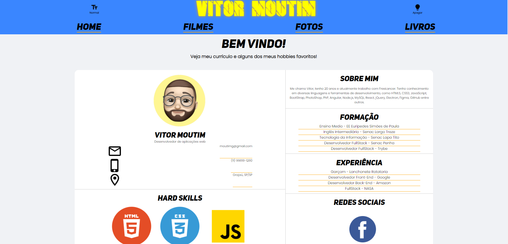

# Primeiro portfólio feito por mim :)

Esse foi um projeto que desenvolvi durante o curso de Web Full Stack, no Senac Penha.

A ideia era fazer um site colocando coisas que você gosta e inserer um curriculo digital.

[Acessar](https://moutim.github.io/vitor-moutim/)

